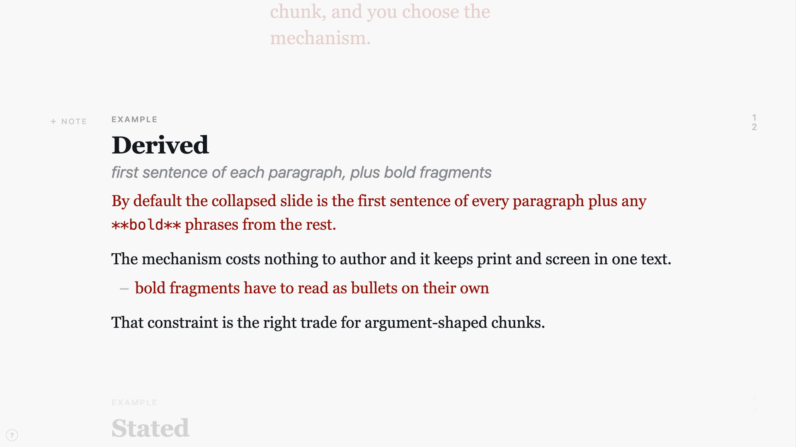
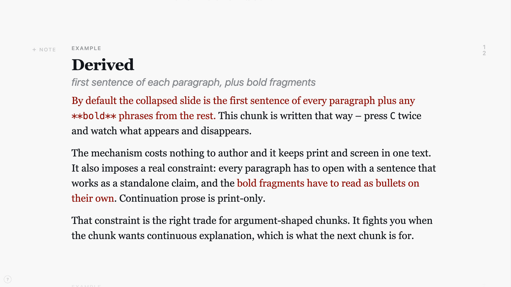
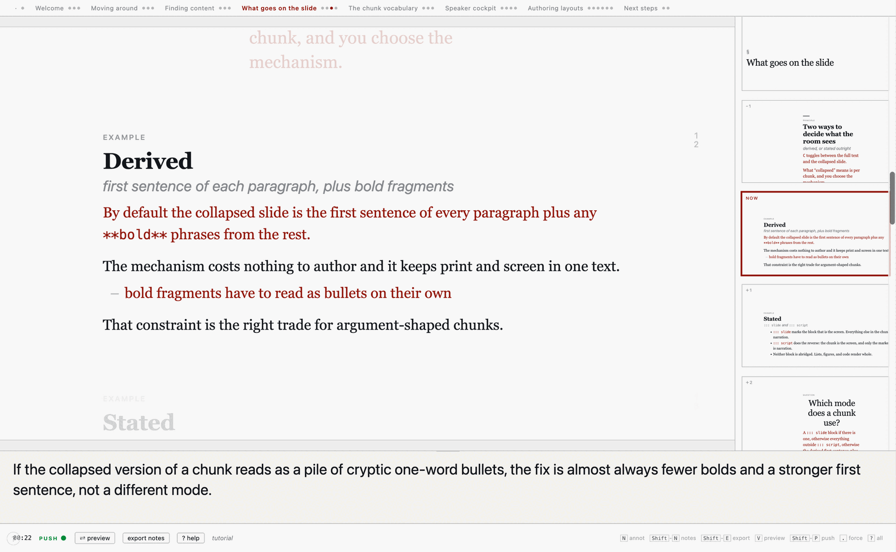
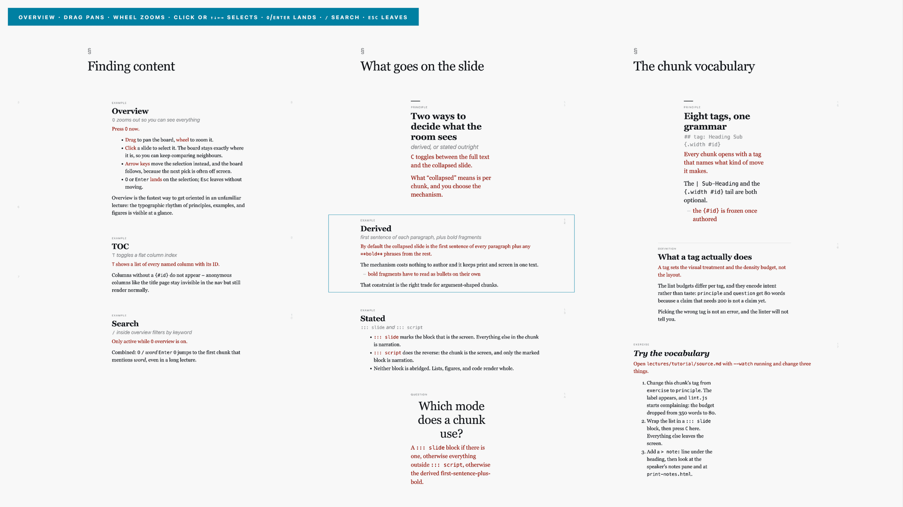
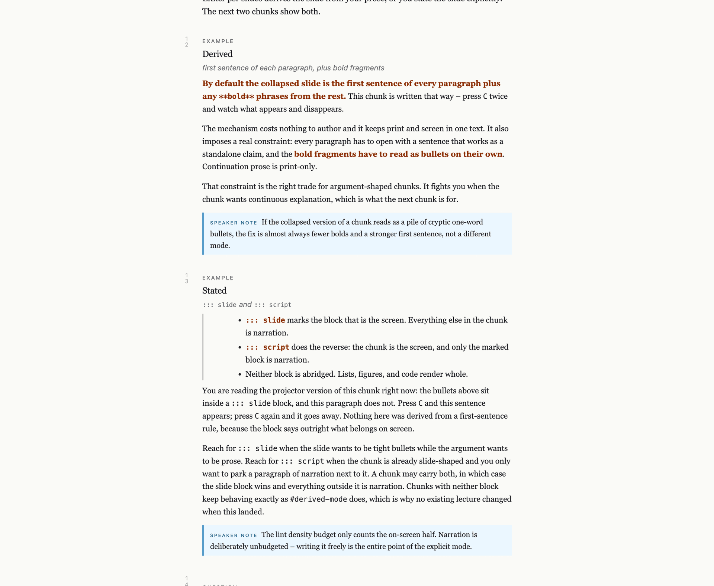

# psi-slides

**Write a lecture once, in one Markdown file. Get four artefacts out of it: the projection for the room, a presenter cockpit, a reading document, and a handout with the spoken notes folded in.**

The problem it solves is drift. Most lecturers keep slides and a script as two documents, and after two semesters they disagree with each other. psi-slides makes them one text: the prose you write is the handout, and the *same* prose – abridged by a rule you control – is what the projector shows. Nothing is written twice, so nothing can fall out of sync.

It is a build script, not an app. `node build.js source.md` writes four self-contained HTML files next to your source. They inline their own CSS, JavaScript, and images, and they open straight from `file://`. No server, no runtime, no cloud account, nothing to install on the lectern machine.

Status: Phase 1, one author, no test suite. It has carried a full semester of university teaching. Read [When *not* to use this](#when-not-to-use-this) before you invest in it.

---

## What it looks like

The core idea in two pictures. Same source, same chunk, one keypress apart – `C` toggles between what the room sees and the full text.

| Collapsed – what the projector shows | Full – the same chunk, unabridged |
| --- | --- |
|  |  |

You did not author two versions. You wrote the right-hand text and marked which fragments matter; the left-hand slide is derived from it.

**The presenter cockpit** (`S` spawns it from the audience view). Column scrubber on top, a mirror of the projector, your private notes below, upcoming chunks down the right edge. Both windows stay in sync – navigation, reveals, zoom, theme, figure focus, laser pointer.



**The overview board** (`O`). Zoom out to the whole lecture at once, drag to pan, `/` to search, `Enter` to land. In an unfamiliar lecture this is the fastest way to get oriented, because the typographic rhythm of principles, examples, and figures is visible at a glance.



**The handout** (`print-notes.html`). The document version of the same lecture with every `> note:` rendered as an aside – “what was on the slide, plus what the lecturer said”, in one PDF-able page flow. There is also a plain `print.html` without the notes, for students.



## Quickstart

Requires Node 20 or newer. Nothing else.

```bash
git clone https://github.com/UBA-PSI/psi-slides.git
cd psi-slides
npm install

node build.js lectures/tutorial/source.md
open lectures/tutorial/audience.html      # macOS; use xdg-open or your browser otherwise
```

That builds the self-referential tour: a lecture that teaches the tool *by being the tool*. Press `?` for the cheat sheet, `S` to spawn the cockpit, `O` for the overview, `C` for collapse. Its source, [`lectures/tutorial/source.md`](lectures/tutorial/source.md), is the authoring reference.

Start your own:

```bash
node build.js --new my-lecture          # scaffold lectures/my-lecture/source.md
node build.js lectures/my-lecture/source.md --watch   # live reload on every save
node lint.js lectures/my-lecture/source.md            # static checks
```

`--watch` pushes a reload over a WebSocket to every open tab, so you can keep the editor, the audience view, and the cockpit visible at once.

## The four views

All four come from one `source.md` and are written next to it.

| File | What it is |
| --- | --- |
| `audience.html` | The projection. One chunk on the stage, camera pans between them, collapse on by default. |
| `speaker.html` | The cockpit. Opens from the audience view with `S`; the two sync over `window.postMessage`. |
| `print.html` | A reading document with a cover and a table of contents. All reveals shown, all expansions inlined. |
| `print-notes.html` | The same document with `> note:` blocks folded in under their chunk. |

Each is a single file. Mail one to a colleague as an attachment and it works.

## How you write

A lecture is columns of chunks. A column is a `#` heading; a chunk is a `##` heading with a tag, and its body is ordinary Markdown.

```markdown
---
title: Anonymous Communication
presenter: Dominik Herrmann
course: advasp
---

# Why mixes need a crowd {#crowd}

## principle: Anonymity is a property of the set | not of the channel {.wide #anon-set}

**Anonymity comes from the others doing the same thing.** A mix node that
forwards exactly one message leaks it by timing alone – the attacker needs a
clock, not cryptanalysis.

The size of the anonymity set is therefore a property of the **traffic**, not
of the protocol. That distinction survives into the exam question.

> note: Ask the room for the smallest set they would trust. Answers cluster
> around 100 and the reasoning is always worth two minutes.
```

The grammar is `## tag: Heading | Sub-heading {.width #id}`. Eight tags (`title`, `principle`, `definition`, `example`, `question`, `figure`, `exercise`, `free`) set the visual treatment and a word budget the linter enforces; four widths (`narrow`, `standard`, `wide`, `full`) set how much stage the chunk takes.

**What lands on the slide** is decided per chunk, by one of two mechanisms:

- **Derived** (the default): the first sentence of every paragraph, plus any `**bold**` fragments. Costs nothing to author, and imposes a real discipline – every paragraph has to open with a claim that stands alone.
- **Stated**: a `::: slide` block *is* the screen, everything else is narration. Or `::: script`, the dual: the chunk is the screen and only the marked block is narration. Reach for these when the argument wants continuous prose that no first-sentence rule can carve up.

Everything else is body-level directives: `---` on its own line splits a chunk into **reveal segments**; `::: expand <label>` hides detail behind a chevron; `::: cols 2` / `::: side` / `::: flip` shape internal layout; `::: margin` and `::: marginalia` place asides; `` resolves against `assets/`. All of it is documented live in the tutorial.

Two more surfaces worth knowing apart: **notes** (`> note:`) are yours, written in advance, shown in the cockpit and in the handout. **Annotations** (`N` during a talk) are typed live, visible to the room, and `Shift-E` plus `--integrate-annotations` writes them back into `source.md` as permanent text.

## When to use this

- Your lecture and its script should be one document, and you are tired of them drifting apart.
- You want a handout that reads as prose, not slides printed six-up.
- You want slides in git – diffable in review, greppable across semesters, mergeable.
- You teach code. Highlighting is [Shiki](https://shiki.style/) at build time, so it is exact and there is no runtime highlighter to load.
- You present from one laptop with an extended display.
- You care how the text sits on the page and would rather compose a lecture than fill a template.

## When *not* to use this

This is the section that will save you the most time. Each line is a real constraint, not a disclaimer.

- **You need `.pptx` or Keynote interop, or a corporate template.** There is no export path. The output is HTML; the only bridge to a slide deck is printing to PDF.
- **A co-author needs a GUI.** The source is Markdown in a text editor and nothing else. If your collaborator will not edit a text file, this will not work for the two of you.
- **You want builds, transitions, or animation.** Reveal segments uncover blocks of text in place. That is the whole animation model, on purpose.
- **You want the cockpit on a tablet and the slides on the projector.** Architecturally unsupported: the two windows sync through `window.postMessage` over the opener relationship, which means same machine, same browser, same profile. A network sync mode is deferred, not planned.
- **You need mathematical notation.** There is no math rendering. KaTeX is named as deferred in `PRD.md` and has not landed; `$x^2$` renders as literal text today.
- **You need polls, quizzes, or any audience interaction.** Named and deferred, same as math.
- **Your room's browser is old or locked down.** See [Requirements](#requirements) – the stylesheets use modern CSS with no fallbacks.
- **You want a dependable dependency.** One `build.js` well past six thousand lines, no test suite, no releases, one maintainer, a format that still moves. It is used in earnest, but it is used by the person who wrote it.

## How it compares

All of the tools below are good, and all of them take Markdown, so “it uses Markdown” is not a reason to pick this one.

**[reveal.js](https://revealjs.com/)** and **[Marp](https://marp.app/)** produce slide decks and are better at being slide decks – themes, transitions, an ecosystem, PDF export that people trust. Neither gives you a reading document from the same source; speaker notes are a sidecar, not a second artefact.

**[Quarto](https://quarto.org/)** is the closest in spirit and much broader: literate computing, many output formats, real math, a large community. If you need executable code cells or a book alongside your slides, use Quarto. It renders slides *and* documents from one source too – what it does not do is derive an abridged slide from your prose, which is the specific thing here.

**[Beamer](https://ctan.org/pkg/beamer)** wins on typography, math, and stability, and loses on iteration speed and on the slides-versus-script split, which it does not address either.

The honest differentiator is the combination: the collapse mechanism (one text, two densities), the presenter cockpit, and the notes-handout – all from one file. If you do not want that combination, one of the tools above is a better bet.

## Requirements

- **Node 20+** to build. Nothing at read time: the outputs are self-contained and open from `file://`.
- **A current browser** to read. The stylesheets use `oklch()` colours, `:has()`, and `text-wrap: balance` with no fallbacks, which puts the floor at roughly **Chrome/Edge 114, Firefox 121, Safari 17.5**. Lectures with inline-styled SVG assets additionally need `@scope`: Chrome/Edge 118, Safari 17.4, Firefox 146. Development and real use are in Chrome; other browsers are untested rather than unsupported.
- **`cwebp` or `magick`** on `PATH`, but only if you use `--optimize-images`. macOS `sips` cannot write WebP, so there is no zero-install fallback for that one command.
- Image assets are inlined automatically when they total under 10 MB. A single asset over 2 MB fails the build rather than silently shipping an external path – `--optimize-images` converts the offenders to WebP, and `--no-inline-images` is the escape hatch.

## Documentation

| Where | What for |
| --- | --- |
| [`lectures/tutorial/source.md`](lectures/tutorial/source.md) | The authoring reference. Build it and read it as a lecture. |
| [`lectures/python-intro/`](lectures/python-intro/) | The richest worked example – 36 chunks, the full layout vocabulary. |
| [`PRD.md`](PRD.md) | Design rationale. Why four views, why this tag set, why collapse has two mechanisms and not four. |
| [`speaker.md`](speaker.md) | The cockpit spec and the `postMessage` sync protocol – which fields travel, which stay local. |
| [`HANDOFF.md`](HANDOFF.md) | Build diary, slice by slice, including the decisions deliberately not taken. German. |
| [`CLAUDE.md`](CLAUDE.md) | Repo conventions and a map of `build.js`. Useful to any contributor, not just to Claude. |

## Command reference

```bash
node build.js <source.md>                    # build all four views
node build.js <source.md> --watch            # live reload
node build.js <source.md> --audience-only    # also --print-only, --print-notes-only, --speaker-only
node build.js --new <slug>                   # scaffold a lecture

node build.js <source.md> --inline-images    # force inlining
node build.js <source.md> --no-inline-images # force external asset paths
node build.js <source.md> --optimize-images --dry-run   # report oversized rasters
node build.js <source.md> --optimize-images             # convert them to WebP in place
node build.js <source.md> --integrate-annotations       # fold exported live annotations back in

node lint.js lectures/                       # all lectures
node lint.js lectures/ --strict              # warnings exit 2
```

The linter checks unknown tags and widths, duplicate or missing chunk IDs, unclosed `:::` directives, per-tag word budgets, duplicate explicit-slide blocks, assets over the inline cap, reveal overuse, orphan columns, and redundant figure captions. A source file can silence a check with `<!-- linter: ignore reveal-overuse, density -->`.

## Hotkeys

Press `?` in either live view for the full on-screen reference. The ones you need on day one:

- `←` `→` columns, `↑` `↓` chunks, `Space` reveal next segment.
- `Enter` / `1`–`9` open expansions, `Esc` backs out.
- `O` overview, `T` table of contents, `/` search (inside overview).
- `C` collapse, `F` font, `A` accent theme, `+` `-` `0` zoom, `B` blank the screen.
- `S` spawn the speaker window, `P` open the print view.
- `N` audience-visible annotation. On the cockpit: `Shift-N` private notes, `V` move the preview strip, `Shift-P` toggle push, `.` force-push.

## Stability

Phase 1. The format is still moving and the version number is `0.1.0` for a reason. Two things are nevertheless safe to build on:

- **`{#id}` attributes are frozen once authored.** They anchor cross-references, TOC entries, sync snapshots, and `localStorage`. Renaming a heading is free; renumbering an ID is not.
- **Generated HTML is disposable.** Rebuild it, do not commit it. The only tracked outputs are `lectures/tutorial/*.html`, so the tour can be browsed from the repository.

## Licence

The tooling – `build.js`, `lint.js`, the documentation – is [MIT](LICENSE). The lecture content under [`lectures/`](lectures/LICENSE) is CC BY-SA 4.0, so you may reuse and adapt it with attribution under the same terms.
